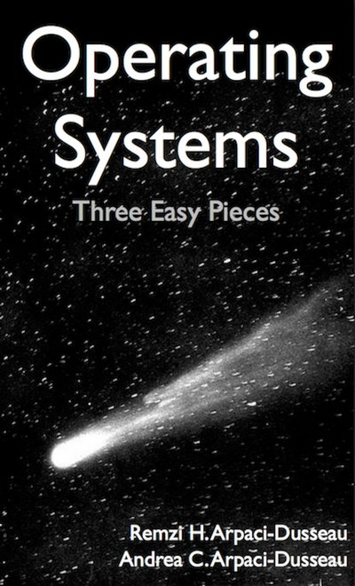

# OSTEP
Repository for the code and exercices as I'm working on the book : Operating Systems: Three Easy Pieces from Arpaci-Dusseau.

https://pages.cs.wisc.edu/~remzi/OSTEP/

Modern operating systems architecture and UNIX kernel interfaces.

